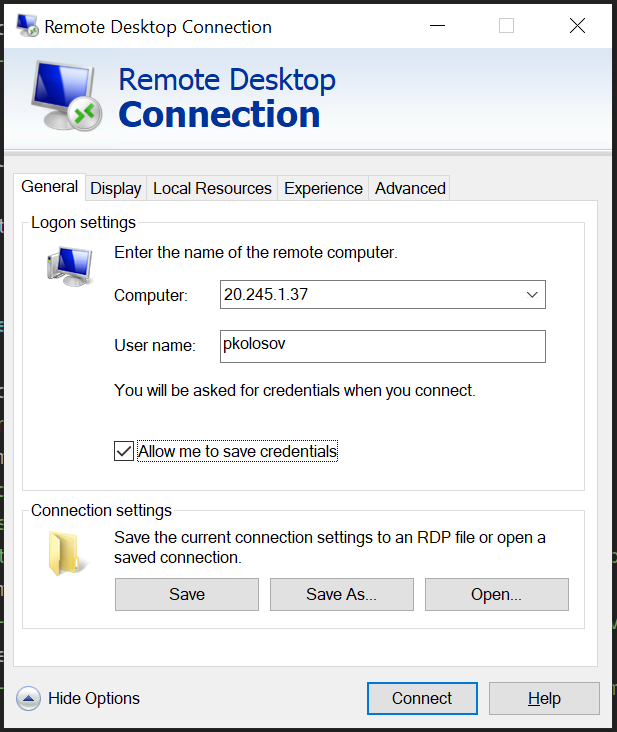
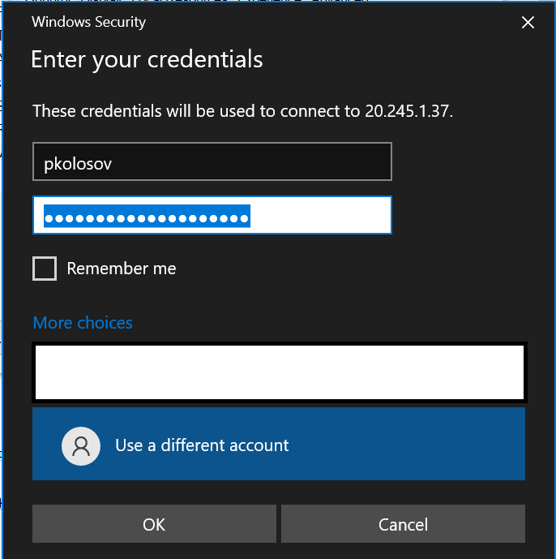

# Create Windows VM using CLI

### Login and subscription management

- Login to your account using device code
    - `az login --use-device-code`

- Check available subscriptions
    - `az account subscription list`

- Check default subscription you have active
    - `az account list -o table`

- Change subscription if necessary
    - `az account set --subscription $subNameOrId`

### Create VM itself

- Create a resource group
    - `$rgName="rg-win-vm-cli"`
    - `$location="westus"`
    - `az group create -n $rgName -l $location`

- Create virtual machine
    - `$vmName="vm-win-cli"`
    - `$vmImage="win2019datacenter"`
    - `$adminUsername="pkolosov"`
    - `$adminPassword="$env:AD_TEST_USER_PASSWORD"`
    - `az vm create -g $rgName -n $vmName --image $vmImage --admin-username $adminUsername --admin-password $adminPassword`

- Open RDP for remote access
    - `$port="3389"`
    - `az vm open-port -g $rgName -n $vmName --port $port`

- Get the IP Addresses for Remote Access
    - `az vm list-ip-addresses -g $rgName -n $vmName -o table`

### Connect to the Windows VM via RDP

- Go to `Search -> Remote Desktop Connection` on your PC

- Clicking `Connect` choose `Use different account`
  and provide your login and password you created VM with

- Approve connection

### Delete resource group

- `az group delete -n $rgName --yes`