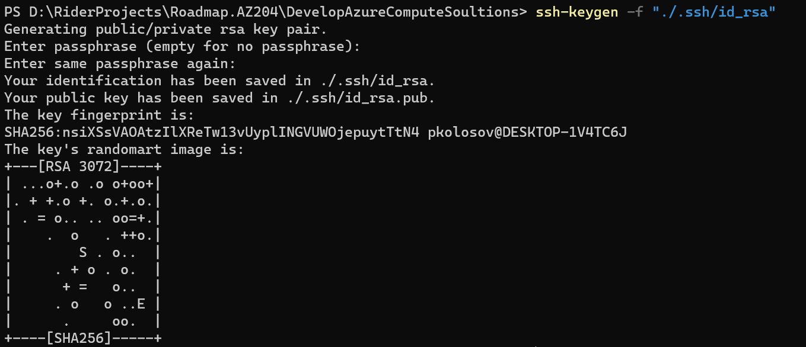
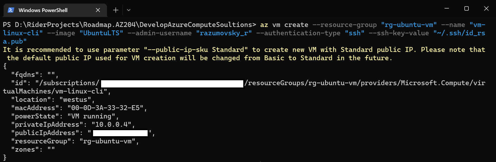
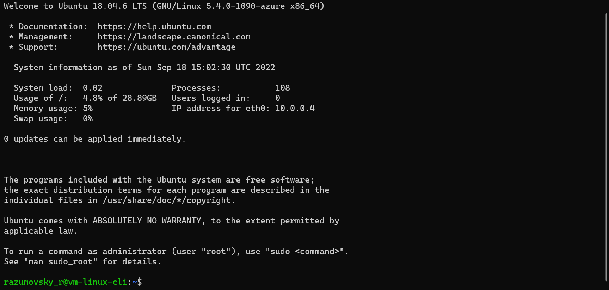

# Create Linux VM using CLI

### Login and subscription management

- Login to your account via CLI
    - `az login --use-device-code`

- Check available subscriptions
    - `az account subscription list`

- Check default subscription you have active
    - `az account list -o table`

- Change subscription if necessary
    - `az account set --subscription "name or id"`

### Create VM itself

- Create resource group
    - `$rgName="rg-ubuntu-vm-cli"`
    - `$location="westus"`
    - `az group create -n $rgName -l $location`

- Generate RSA key pair in current directory
    - `mkdir ./.ssh`
    - `ssh-keygen -f "./.ssh/id_rsa"`

- Create VM providing public key
    - `$vmName="vm-ubuntu-cli"`
    - `$vmImage="UbuntuLTS"`
    - `$adminUsername="razumovsky_r"`
    - `$sshKeyPath="~/.ssh/id_rsa.pub"`
    - `az vm create -g $rgName -n $vmName --image $vmImage --admin-username $adminUsername --authentication-type "ssh" --ssh-key-value $sshKeyPath`

- Open SSH port of the VM
    - `az vm open-port -g $rgName -n $vmName --port "22"`

- Check IP address of the VM
    - `az vm list-ip-addresses -g $rgName -n $vmName -o table`

- Define IP address variable
    - `$ipAddress=$(az vm list-ip-addresses -g $rgName -n $vmName --query '[].{ip:virtualMachine.network.publicIpAddresses[0].ipAddress}' -o tsv)`
    - `echo $ipAddress`

- Connect to the VM via SSH
    - `ssh $adminUsername@$ipAddress`

### Delete resource group

- `az group delete -n $rgName --yes`