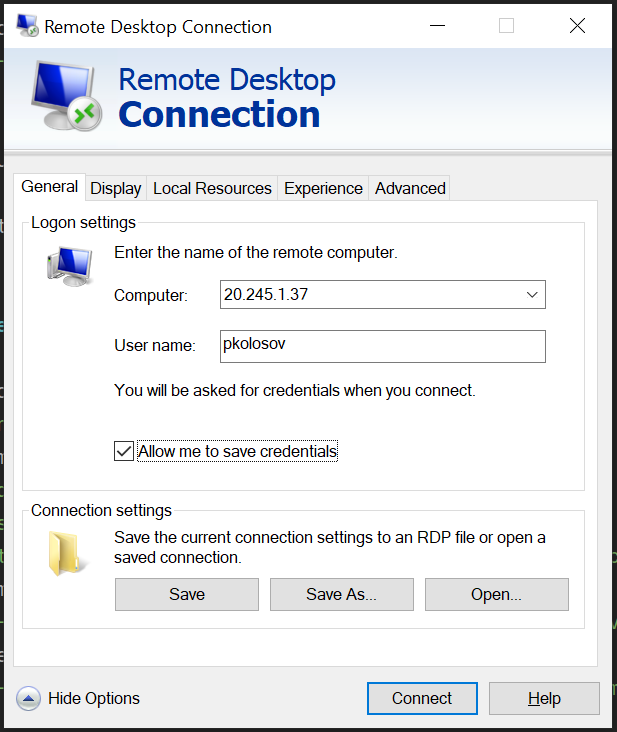
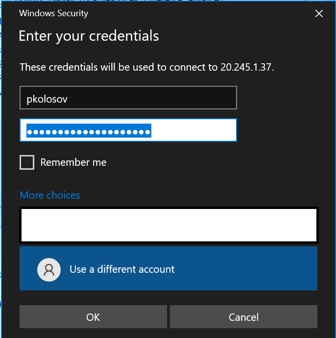
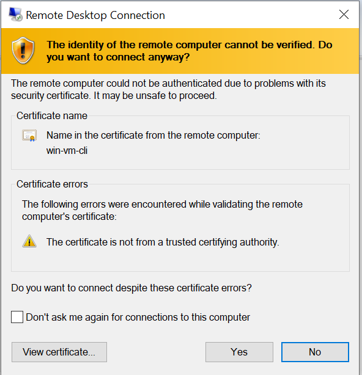

# Create Windows VM using CLI

### Login and subscription management

- Login to your account via CLI
    - `az login --use-device-code`
- Check available subscriptions
    - `az account subscription list`
- Check default subscription you have active
    - `az account list -o table`
- Change subscription if necessary
    - `az account set --subscription "name or id"`

### Create VM itself

- Create a resource group
    - `az group create --name "rg-windows-vm" --location "westus"`
- Create virtual machine
    - `$vmPassword=$env:AD_TEST_USER_PASSWORD`
    - `echo $vmPassword`
    - `az vm create --resource-group "rg-windows-vm" --name "win-vm-cli" --image "win2019datacenter" --admin-username "pkolosov" --admin-password "$vmPassword"`
- Open RDP for remote access
    - `az vm open-port --resource-group "rg-windows-vm" --name "win-vm-cli" --port "3389"`
- Get the IP Addresses for Remote Access
    - `az vm list-ip-addresses --resource-group "rg-windows-vm" --name "win-vm-cli" --output table`
      [VM_ip_address](./img/01_get_vm_ip_address.PNG)

### Connect to the Windows VM via RDP

- Go to `Search -> Remote Desktop Connection` on your PC

- Clicking `Connect` choose `Use different account`
  and provide your login and password you created VM with

- Approve connection

### Delete resource group

- `az group delete --name "rg-windows-vm" --yes`