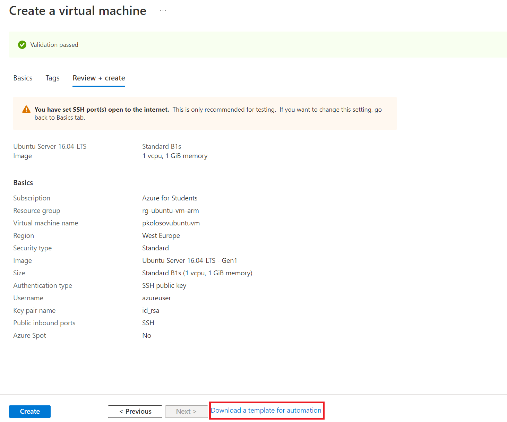
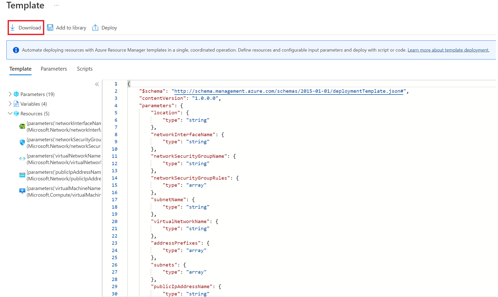
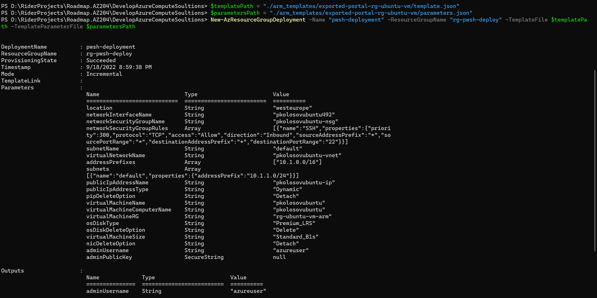

# Deploy ARM template using Az Powershell

### Get ARM template via Azure Portal

- Start resource creation, then stop on last stage, do not deploy it
- Download template zip using `Download a template for automation`

- Review and download the template

### Login

- `Connect-AzAccount -SubscriptionName "Azure for Students"`

### Ensure you're pointed at your correct subscription

-`Set-AzContext -SubscriptionName "Azure for Students"`

### Create the Resource Group

- `New-AzResourceGroup -Name "rg-pwsh-deploy" -Location "CentralUS"`

### Deploy ARM Templates using Azure PowerShell

- `$templatePath = "./arm_templates/exported-portal-rg-ubuntu-vm/template.json"`
- `$parametersPath = "./arm_templates/exported-portal-rg-ubuntu-vm/parameters.json"`
- `New-AzResourceGroupDeployment -Name "pwsh-deployment" -ResourceGroupName "rg-pwsh-deploy" -TemplateFile $templatePath -TemplateParameterFile $parametersPath`

### Review PowerShell output

### Delete resource group

- `Remove-AzResourceGroup -Name "rg-pwsh-deploy"`
