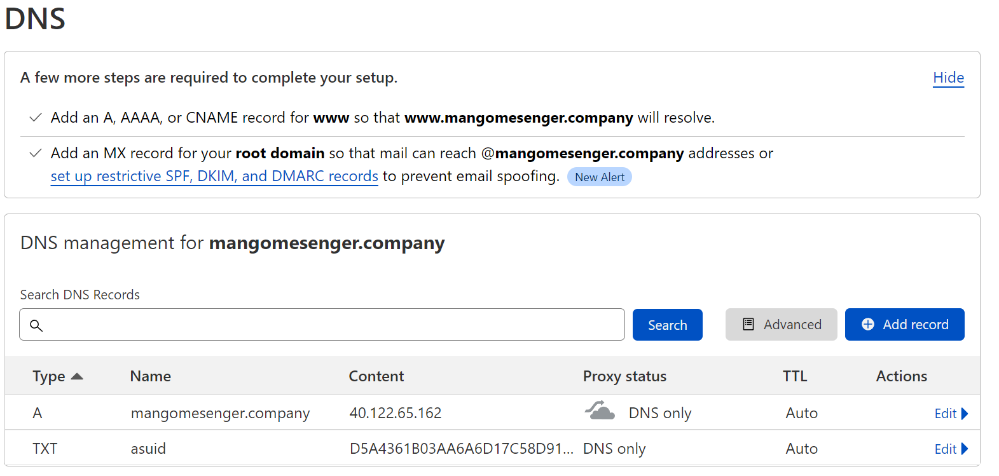

# App Service add custom domain

### Create web app (B1 to have domains + SSL)

- Create resource group
    - `az group create --name "rg-custom-domain-ssl" --location "centralus"`
- Create app service plan:
    - `$planname="plan$(Get-Random)"`
    - `az appservice plan create --name $planname --resource-group "rg-custom-domain-ssl" --sku "B1"`
    - Available values for sku:
        - `B1, B2, B3, D1, F1, FREE, I1, I1v2, I2, I2v2, I3, I3v2, P1V2, P1V3, P2V2, P2V3, P3V2, P3V3, S1, S2, S3, SHARED, WS1, WS2, WS3`
- Check available app service runtimes:
    - `az webapp list-runtimes`
- Create app service:
    - `az webapp create --resource-group "rg-custom-domain-ssl" --name "apipkolosov" --plan $planname --runtime "dotnet:6"`

### Add custom domain

- Azure Portal

### Configure Cloudflare

### Domain added successfully

### Check domain in browser

