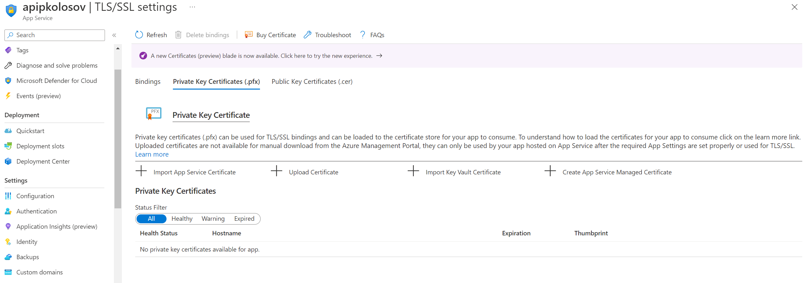
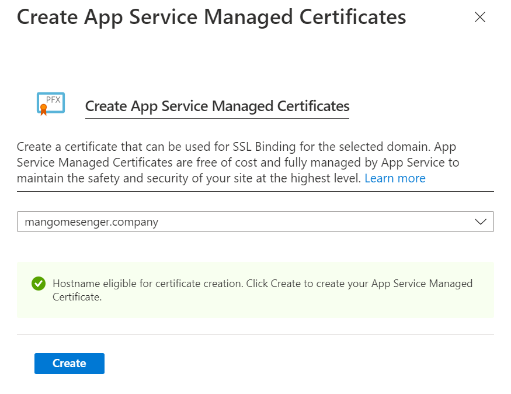
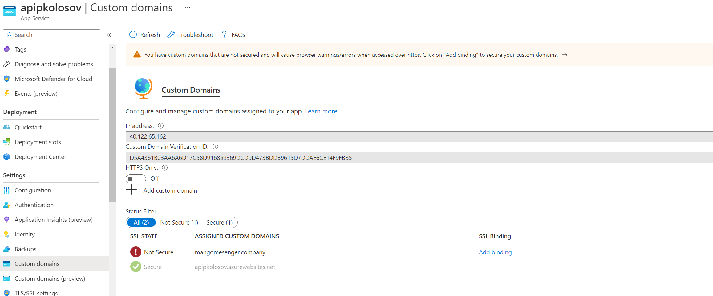
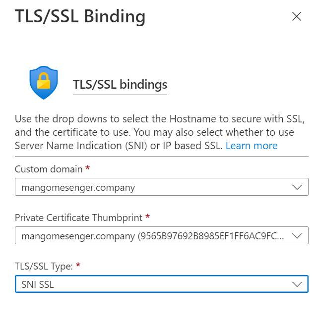
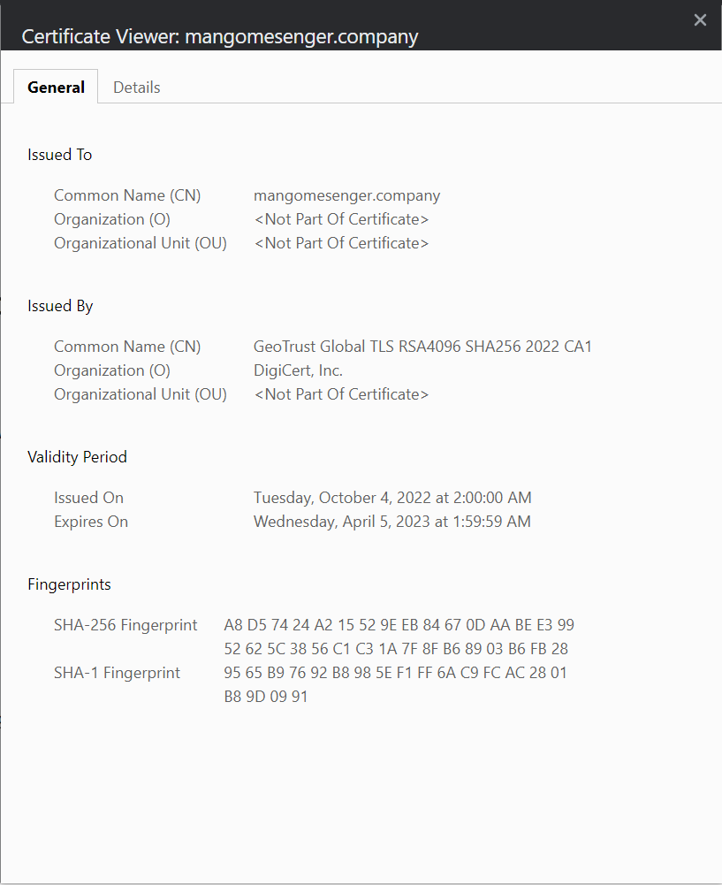

# Configure SSL for custom domain

It is assumed that you have already configured your custom domain for web app under specified app service plan.
It not -- proceed to [App service add custom domain](./14_app_service_add_custom_domain.md)

### Go to SSL/TSL settings, bindings blade in Azure Portal

### Click `Create App Service Managed Certificate`

### Go back to Custom domains blade, add binding

### Check certificate

