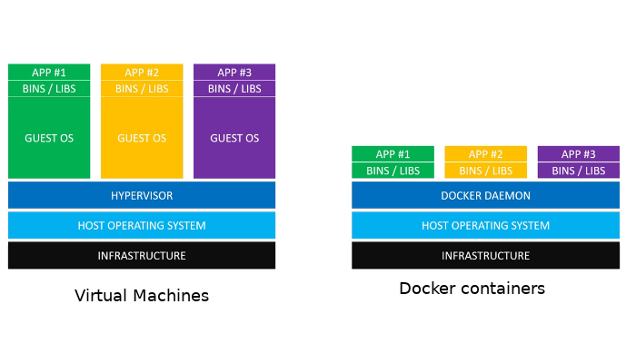

# Azure Container Registry Practice

Well, yet another practice today, this time we fight against Azure Container registry.
The scope of current kata is to reach the deep understanding of how to build, push and deploy containerized apps to the
azure container registry and container instances.
So, the following to be done:

- Create `DockerFile` and describe its steps in details
- Build `DockerFile` locally with appropriate tag*s
- Create `Azure container registry` using CLI
- Push image to the `ACR` using appropriate authorization
- Deploy image to the `Azure container instances`

## Docker architecture

Just for inform purposes and to refresh memory

  

## Infrastructure provision

- Create resource group: `az group create --name "rg-acr-practice" --location "westus"`
- Define registry name as powershell variable: `$registryName="pkolosovregistry"`
- Check that ACR name is available: `az acr check-name --name $registryName`
- Create ACR: `az acr create --resource-group "rg-acr-practice" --name $registryName --sku "Basic"`
- List all container registries inside subscription: `az acr list`
- List all container registries inside subscription: `az acr list --query "max_by([], &creationDate).name" --output tsv`

## DockerFile creation

- It is done and commented directly
  there: [DockerFile](https://github.com/kolosovpetro/ACRPractice.AZ204/blob/master/Dockerfile)

## Build DockerFile and tag it properly

- Define powershell variable for container registry name:
    - Compute way: `$ACR_NAME=$(az acr list --query "max_by([], &creationDate).name" --output tsv)`
    - Hardcoded way: `$ACR_NAME=pkolosovregistry`
- Define ACR url:
    - Compute way: `$ACR_URL="$ACR_NAME.azurecr.io"`
    - Hardcoded way: `$ACR_URL="pkolosovregistry.azurecr.io"`
- Define powershell variable for ACR repository: `$ACR_REPOSITORY="acr-practice-repository"`
- Define powershell version variable: `$IMAGE_VERSION="1.0"`
- Define image tag: `$IMAGE_TAG="acr-practice-image-$IMAGE_VERSION"`
- Build docker image:
    - Compute way: `docker build -t "${ACR_REPOSITORY}:$IMAGE_TAG" .`
    - Hardcoded way: `docker build -t "acr-practice-repository:acr-practice-image-1.0" .`
- Run image locally to test: `docker run -d -p 9000:80 --name acr-practice-test-run "${ACR_REPOSITORY}:$IMAGE_TAG"`
- Navigate and verify app: `http://localhost:9000/swagger/index.html`

## Create service principal and login to ACR

- Read documentation about RBAC for
  ACR: [MSDN](https://docs.microsoft.com/en-us/azure/container-registry/container-registry-roles?tabs=azure-cli)
- Define variable for service principal name: `$SERVICE_PRINCIPAL_NAME="PetroKolosovServicePrincipal"`
- Define ACR ID variable: `$ACR_REGISTRY_ID=$(az acr show --name $ACR_NAME --query "id" --output tsv)`
    - Btw it looks
      like: `/subscriptions/{id}/resourceGroups/rg-acr-practice/providers/Microsoft.ContainerRegistry/registries/pkolosovregistry`
- Define password
  variable: `$PASSWORD=$(az ad sp create-for-rbac --name $SERVICE_PRINCIPAL_NAME --scopes $ACR_REGISTRY_ID --role acrpush --query "password" --output tsv)`
    - Note (!!!): Password cannot be collected again, write it somewhere
- Define username
  variable: `$USER_NAME=$(az ad sp list --display-name $SERVICE_PRINCIPAL_NAME --query "[].appId" --output tsv)`
- Validate password: `echo $PASSWORD`
- Validate username: `echo $USER_NAME`
- Login to ACR: `docker login $ACR_URL --username $USER_NAME --password $PASSWORD`

## Tag docker image and push to ACR

- Push requires authentication using login password pair or service principal
- Tag image: `docker tag "${ACR_REPOSITORY}:$IMAGE_TAG" "$ACR_URL/${ACR_REPOSITORY}:latest"`
- Push to ACR:
    - With variables: `docker image push -a "$ACR_URL/$ACR_REPOSITORY"`
    - Hardcoded: `docker image push -a "pkolosovregistry.azurecr.io/acr-practice-repository"`

## Deploy docker image to Azure Container Instances

- Deploy
  command: `az container create --resource-group "rg-acr-practice" --name "rg-acr-practice-cli-deploy" --dns-name-label "rg-acr-practice-cli-deploy" --ports 80 --image "$ACR_URL/${ACR_REPOSITORY}:latest" --registry-login-server $ACR_URL --registry-username $USER_NAME --registry-password $PASSWORD`
- Deploy guid: https://docs.microsoft.com/en-us/azure/container-instances/container-instances-github-action
- Store group ID: `$groupId=$(az group show --name "rg-acr-practice" --query id --output tsv)`
- Create SP: `az ad sp create-for-rbac --scope $groupId --role Contributor --sdk-auth`
- Store registry ID
  variable: `$registryId=$(az acr show --name "pkolosovregistry" --resource-group "rg-acr-practice" --query id --output tsv)`
- Update role: `az role assignment create --assignee "clientId" --scope $registryId --role AcrPush`

## Notes

- To build on behalf of Azure: `az acr build --registry $acrName --image ipcheck:latest .`