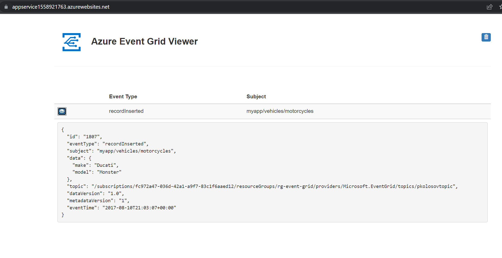

# Create event grid using CLI and send events from Postman

App service source code: https://github.com/Azure-Samples/azure-event-grid-viewer

- Create resource group
    - `$rgName="rg-eventgrid-cli"`
    - `$location="westus"`
    - `az group create -n $rgName -l $location`

- Register event grid provider
    - `az provider register --namespace Microsoft.EventGrid`

- Check event grid provider registration status
    - `az provider show --namespace Microsoft.EventGrid --query "registrationState"`

- Create custom event grid topic
    - `$topicname="pkolosovtopic"`
    - `az eventgrid topic create -g $rgName -n $topicName -l $location`

- Create message endpoint
    - `$sitename="app-eventgrid-cli"`
    - `$templateUri="https://raw.githubusercontent.com/Azure-Samples/azure-event-grid-viewer/master/azuredeploy.json"`
    - `az deployment group create -g $rgName --template-uri $templateUri --parameters siteName=$sitename hostingPlanName="viewerhost"`

- Subscribe to event grid topic endpoint
    - `$endpoint="https://$sitename.azurewebsites.net/api/updates"`
    - `$subId="fc972a47-036d-42a1-a9f7-83c1f6aaed12"`
    - `$sourceId="/subscriptions/$subId/resourceGroups/$rgname/providers/Microsoft.EventGrid/topics/$topicname"`
    - `$eventSubName="demoViewerSub"`
    - `az eventgrid event-subscription create -n $eventSubName --source-resource-id $sourceId --endpoint $endpoint`

- Get topic endpoint and key
    - `$topicEndpoint=$(az eventgrid topic show -g $rgName -n $topicname --query "endpoint" -o tsv)`
    - `$key=$(az eventgrid topic key list -g $rgName -n $topicname --query "key1" -o tsv)`

- Delete resource group
    - `az group delete -n $rgName --yes`

## Authorization

- Set request header: `aeg-sas-key: $key`

## Postman request

## App service

