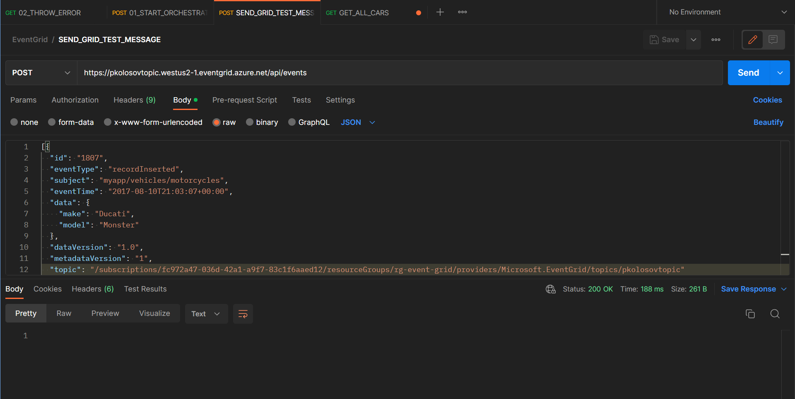

# Create event grid using PowerShell and send events from Postman

App service source code: https://github.com/Azure-Samples/azure-event-grid-viewer

- Create resource group
    - `$rgname="rg-event-grid-$(Get-Random 1000)"`
    - `New-AzResourceGroup -Name $rgname -Location "westus"`
- Register event grid namespace
    - `Register-AzResourceProvider -ProviderNamespace Microsoft.EventGrid`
- Check event grid namespace registration status
    - `Get-AzResourceProvider -ProviderNamespace Microsoft.EventGrid`
- Create custom topic
    - `$topicname="topic$(Get-Random 1000)"`
    - `New-AzEventGridTopic -ResourceGroupName $rgname -Location "westus2" -Name $topicname`
- Create message endpoint
    - `$sitename="appservice$(Get-Random 1000)"`
    - `$templateUri="https://raw.githubusercontent.com/Azure-Samples/azure-event-grid-viewer/master/azuredeploy.json"`
    - `New-AzResourceGroupDeployment -ResourceGroupName $rgname -TemplateUri $templateUri -siteName $sitename -hostingPlanName "viewerhost"`
- Subscribe to endpoint
    - `$endpoint="https://$sitename.azurewebsites.net/api/updates"`
    - `$subId="fc972a47-036d-42a1-a9f7-83c1f6aaed12"`
    - `$sourceId="/subscriptions/$subId/resourceGroups/$rgname/providers/Microsoft.EventGrid/topics/$topicname"`
    - `New-AzEventGridSubscription -EventSubscriptionName "demoViewerSub" -Endpoint $endpoint -ResourceGroupName $rgname -TopicName $topicname`
- Send event to your custom topic
    - `$gridendpoint=(Get-AzEventGridTopic -ResourceGroupName $rgname -Name $topicname).Endpoint`
    - `$keys=Get-AzEventGridTopicKey -ResourceGroupName $rgname -Name $topicname`
- Delete resource group
    - `Remove-AzResourceGroup -Name $rgname`

## Postman request

## App service

