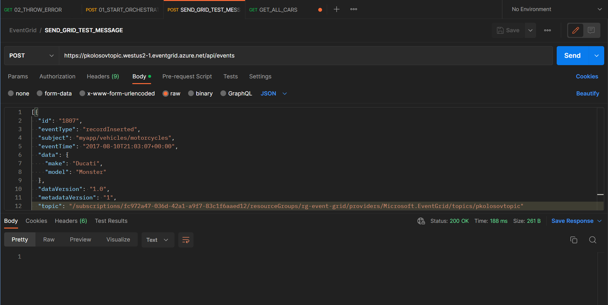
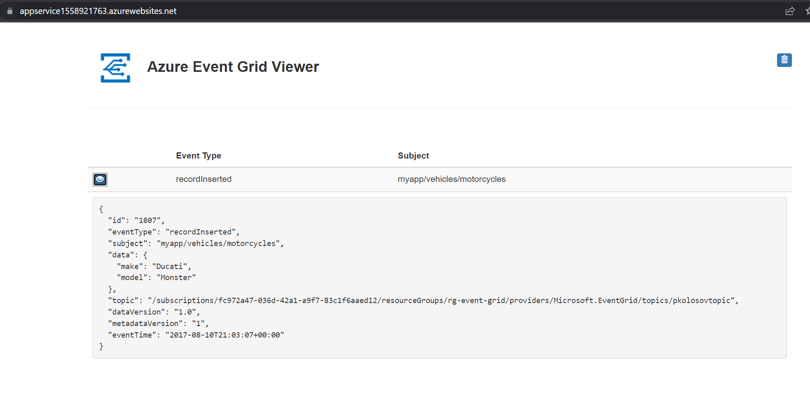

# Create event grid using PowerShell and send events from Postman

App service source code: https://github.com/Azure-Samples/azure-event-grid-viewer

- Create resource group
    - `$rgName="rg-eventgrid-pwsh"`
    - `$location="westus"`
    - `New-AzResourceGroup -Name $rgName -Location $location`

- Register event grid provider
    - `Register-AzResourceProvider -ProviderNamespace Microsoft.EventGrid`

- Check event grid provider registration status
    - `Get-AzResourceProvider -ProviderNamespace Microsoft.EventGrid`

- Create custom event grid topic
    - `$topicName="topicpwsh"`
    - `New-AzEventGridTopic -ResourceGroupName $rgName -Name $topicName -Location $location`

- Create message endpoint
    - `$sitename="app-eventgrid-pwsh"`
    - `$templateUri="https://raw.githubusercontent.com/Azure-Samples/azure-event-grid-viewer/master/azuredeploy.json"`
    - `New-AzResourceGroupDeployment -ResourceGroupName $rgName -TemplateUri $templateUri -siteName $sitename -hostingPlanName "viewerhost"`

- Subscribe to endpoint
    - `$endpoint="https://$sitename.azurewebsites.net/api/updates"`
    - `$subId="fc972a47-036d-42a1-a9f7-83c1f6aaed12"`
    - `$sourceId="/subscriptions/$subId/resourceGroups/$rgname/providers/Microsoft.EventGrid/topics/$topicname"`
    - `$eventSubName="demoViewerSub"`
    - `New-AzEventGridSubscription -ResourceGroupName $rgName -TopicName $topicName -EventSubscriptionName $eventSubName -Endpoint $endpoint`

- Send event to your custom topic
    - `$gridEndpoint=(Get-AzEventGridTopic -ResourceGroupName $rgName -Name $topicName).Endpoint`
    - `$keys=Get-AzEventGridTopicKey -ResourceGroupName $rgName -Name $topicName`

- Delete resource group
    - `Remove-AzResourceGroup -Name $rgName`

## Authorization

- Set request header: `aeg-sas-key: $keys`

## Postman request

## App service

